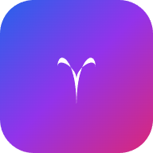

# VibeMatch 💫

[](https://flutter.dev/)
[](https://dart.dev/)
[](https://opensource.org/licenses/MIT)

## 🎯 Overview

**VibeMatch** is a modern, cross-platform social discovery and matching app built with Flutter. Connect with people who share your vibes through fun games, real-time chats, and smart matching. Perfect for dating, friendships, or interest-based connections.

Featuring smooth animations, Riverpod state management, and responsive design for mobile, web, and desktop.

<div align="center">
  
  <!-- Add screenshots here: e.g.  -->
</div>

## ✨ Features

- **🔐 Secure Authentication**: Login/Signup with API integration & token storage.
- **👥 Profile Management**: Edit profiles, upload images with image_picker.
- **🎮 Vibe Game**: Interactive game for fun matching (vibe_game.dart).
- **🔍 Discover & Matches**: Browse users, view matches & requests.
- **💬 Real-time Messaging**: Chats, messages with WebSocket support.
- **🏠 Home Dashboard**: Navigation hub with discover/home/matches.
- **⚙️ Settings & Theme**: Custom themes, dark/light mode with Riverpod.
- **📱 Cross-platform**: Android, iOS, Web, Desktop (Windows/macOS/Linux).

## 🛠 Tech Stack

| Category     | Technologies              |
| ------------ | ------------------------- |
| Framework    | Flutter (Material Design) |
| State Mgmt   | Riverpod                  |
| Networking   | HTTP, WebSocket Channel   |
| Storage      | Shared Preferences        |
| Media        | Image Picker              |
| Architecture | Clean MVC/Services/Models |
| Styling      | Custom Themes/TextStyles  |

## 🚀 Quick Start

### Prerequisites

- [Flutter SDK](https://docs.flutter.dev/get-started/install) (v3.24+)
- Dart SDK 3.10+
- Android Studio / Xcode / VS Code (for respective platforms)
- Git

### Setup

1. **Clone the repo**:

   ```bash
   git clone https://github.com/ajilaries/VibeMatch.git
   cd vibematch
   ```

2. **Install dependencies**:

   ```bash
   flutter pub get
   ```

3. **Run the app**:
   ```bash
   flutter run
   ```

   - Mobile: Connect device or use emulator.
   - Web: `flutter run -d chrome`
   - Desktop: `flutter run -d windows` (or mac/linux).

### Build for Release

- **Android APK**:
  ```bash
  flutter build apk --release
  ```
- **iOS** (macOS only):
  ```bash
  flutter build ios --release
  ```
- **Web**:
  ```bash
  flutter build web
  ```

## 📂 Project Structure

```
lib/
├── core/          # Utils, services (API/Auth/Chat), theme
├── features/      # Messages, navigation
├── models/        # User/Match/Message
├── screens/       # All UI screens (auth/home/chat/game/profile)
├── widgets/       # Reusable components
└── main.dart
```

## 🤝 Contributing

1. Fork the repo.
2. Create feature branch (`git checkout -b feature/AmazingFeature`).
3. Commit changes (`git commit -m 'Add some AmazingFeature'`).
4. Push (`git push origin feature/AmazingFeature`).
5. Open Pull Request.

## 📄 License

This project is [MIT](LICENSE) licensed - see [LICENSE](LICENSE) file.

---

⭐ **Star this repo if you find it useful!** ⭐
